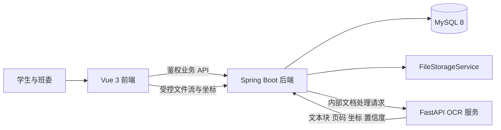

# 架构说明

## 系统边界

系统采用前后端分离的 monorepo。Spring Boot 是业务与安全边界；FastAPI OCR 服务只处理文档识别；Vue 应用负责交互和 PDF 展示；MySQL 保存结构化业务数据及文档元数据。原始 PDF 不通过公开静态目录暴露。

## 组件职责

### Frontend

Vue Router 负责页面边界，Element Plus 提供基础组件，PDF.js 后续负责 PDF 渲染、页码跳转和坐标覆盖层。前端显示 OCR 候选并采集人工框选，但不承担权限判断、审核状态机或最终计分。

### Backend

Spring Security 在服务端实施“本人或本班班委”授权。业务服务后续管理申报状态、规则版本、审核记录和导出前置条件。Flyway 是唯一数据库 schema 变更路径。

`FileStorageService` 隔离业务代码与文件介质。开发实现使用不可公开访问的本地目录；未来可替换对象存储，而无需改变业务模型。

### OCR service

服务接收内部文档处理请求并返回统一的 `OCRBlock` 结构。文字层提取和 PaddleOCR 应实现同一端口。模型缓存、临时页图和识别输出位于 Git 忽略目录。OCR 服务不能写入业务分值或审核决定。

## 关键数据关系

后续核心关系为：用户通过班级成员关系获得角色；申报条目与证明文件是多对多；OCR 文本块归属于具体文件版本；证据标注归属于申报条目和文件；审核记录保持不可变；班级绑定规则版本。

本轮不提前创建这些完整实体或数据库表。第一个业务切片确定字段和约束后，再通过 Flyway 增量落库。

## 安全与一致性

- 文件下载、OCR 结果和标注查询均通过后端资源级授权。
- 可猜测 URL 不能直接访问证明材料。
- 文件替换产生新版本，历史审核继续引用原版本。
- 申报状态变化和审核记录写入应在事务中完成。
- 自动定位结果不得自动确认；人工标注优先于机器候选。
- 同一数据和规则版本的重复计算及导出必须产生一致结果。
